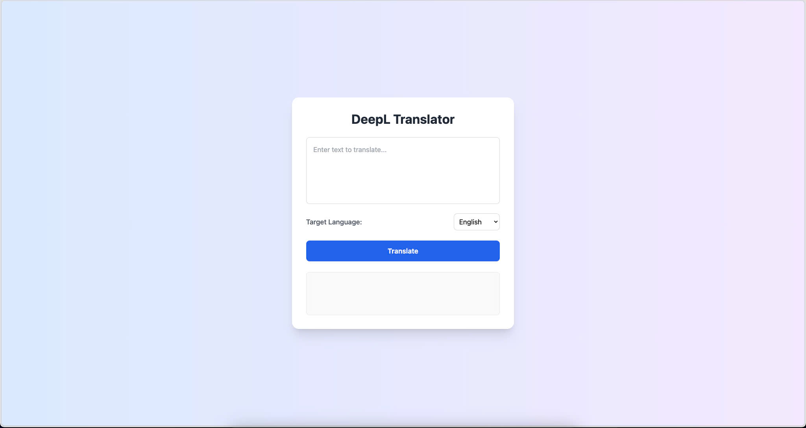

# DeepL Translator Web App

A simple web application for translating text using the DeepL API.



## Features

- Translate text to multiple languages (English, French, German, Spanish, Italian, Japanese, Chinese, ...)
- Clean and responsive UI with Tailwind CSS
- Built with Node.js and Express backend
- Docker container support

## Prerequisites

- Node.js (v18 or higher)
- npm or yarn
- DeepL API key (free tier available)
- Docker (optional)

## Installation

1. Clone the repository:

   ```bash
   git clone https://github.com/darealpaoo/deepl-translator.git
   cd deepl-translator
   ```

2. Install dependencies:

   ```
   npm install
   ```

3. Create a .env file in the root directory and add your DeepL API key:

   ```
   DEEPL_AUTH_KEY=your-api-key-here
   ```

## Usage

1. Running locally

   ```
   npm start
   ```

   The application will be available at http://localhost:3000

2. Running with Docker

- Build the Docker image:

  ```
  docker build -t deepl-translator .
  ```

- Run the container:

  ```
  docker run -p 3000:3000
  ```
