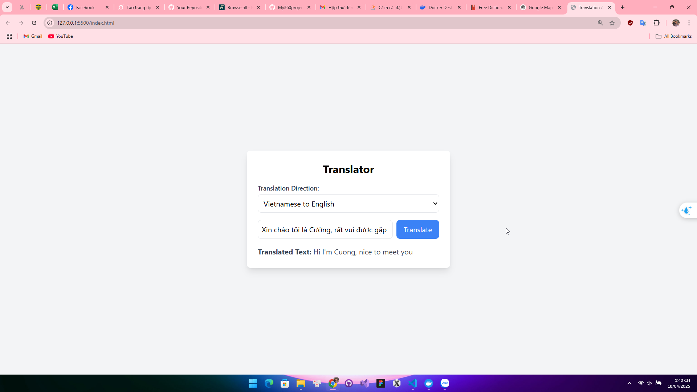

Hiển thị bản đồ tương tác mặc định tại Hà Nội, Việt Nam.

Người dùng có thể nhập địa chỉ để tìm kiếm (ví dụ: "Hà Nội, Việt Nam").

Sử dụng Google Geocoding API để chuyển địa chỉ thành tọa độ (latitude, longitude).

Hiển thị marker (ghim) tại vị trí tìm kiếm trên bản đồ.

Thông báo kết quả địa chỉ hoặc lỗi nếu không tìm thấy.

Sử dụng các: 

- HTML5 & CSS3 – tạo giao diện và định dạng trang.

- JavaScript thuần (ES6) – xử lý sự kiện và tích hợp API.

- Google Maps JavaScript API – hiển thị bản đồ và marker.

- Google Geocoding API – chuyển đổi địa chỉ thành tọa độ.

