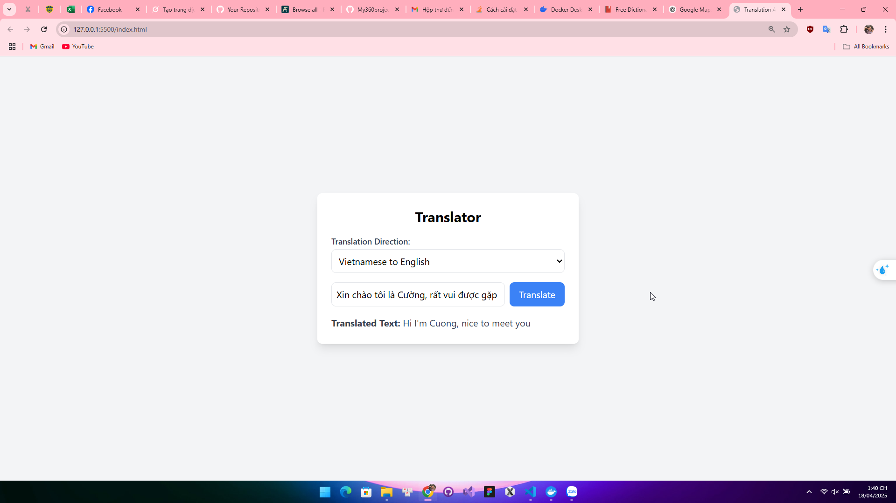

Ứng dụng đơn giản dùng để dịch qua lại giữa tiếng Anh và tiếng Việt bằng cách sử dụng API từ MyMemory Translation API. Giao diện được xây dựng bằng HTML và TailwindCSS, còn logic chính được xử lý bằng JavaScript.

