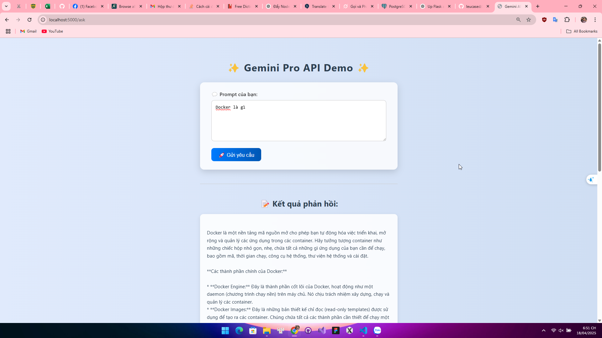

🚀 Flask Gemini API App
Ứng dụng web đơn giản sử dụng Flask để gửi yêu cầu đến Google Gemini API (Generative Language API) và hiển thị phản hồi từ mô hình Gemini 1.5 Pro.

🧠 Tính năng
Giao diện web đơn giản với một ô nhập liệu.

Gửi prompt đến Gemini API.

Hiển thị phản hồi văn bản từ mô hình AI.

docker run -p 5000:5000 wee20o4/flask-gemini-app