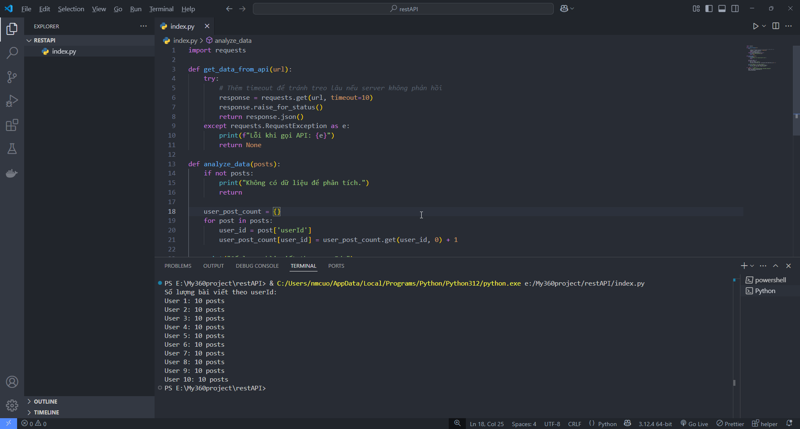

API Post Analyzer

Một script Python đơn giản để gọi dữ liệu từ API và phân tích số lượng bài viết theo từng người dùng.

Chức năng
- Gửi request HTTP đến API mẫu.
- Phân tích dữ liệu JSON trả về.
- Thống kê số lượng bài viết (posts) theo `userId`.

